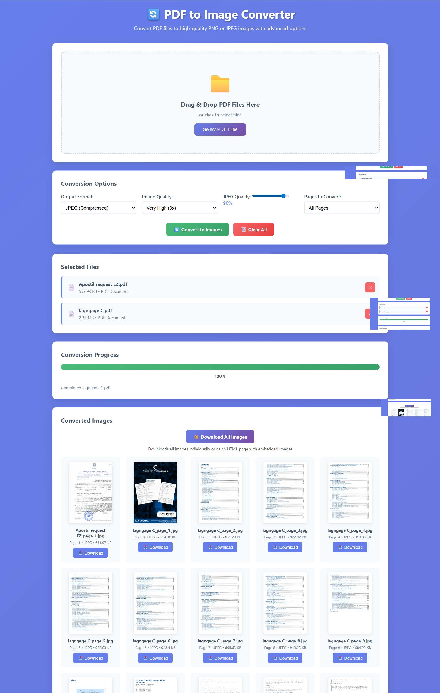

# 🔄 PDF to Image Converter

<div align="center">



**A powerful, client-side PDF to PNG/JPEG converter that runs entirely in your browser**

[](https://opensource.org/licenses/MIT)
[](https://developer.mozilla.org/en-US/docs/Web/JavaScript)
[](https://mozilla.github.io/pdf.js/)
[](#)

[🚀 Live Demo](#quick-start) • [📖 Documentation](#documentation) • [🤝 Contributing](#contributing) • [📄 License](#license)

</div>

---

## 🌟 Overview

Transform your PDF documents into high-quality images with our advanced, privacy-focused converter. No server uploads required - all processing happens locally in your browser for maximum security and speed.

## ✨ Key Features

### 🎯 **Core Functionality**
- **📁 Multiple PDF Support** - Process multiple files simultaneously
- **🎨 Dual Format Output** - Convert to PNG (lossless) or JPEG (compressed)
- **⚡ Quality Control** - 5 quality levels from fast (1x) to ultra (4x)
- **📄 Smart Page Selection** - All pages, first page, or custom ranges
- **🔄 Batch Processing** - Handle multiple files with real-time progress
- **🖼️➡️📄 Images to PDF** - Convert multiple images into a single PDF
- **🎨 Image Tools** - Resize, compress, and format conversion (coming soon)
- **📋 PDF Tools** - Merge, split, and compress PDFs (coming soon)

### 🎨 **User Experience**
- **🖱️ Drag & Drop Interface** - Intuitive file selection with visual feedback
- **📊 Real-time Progress** - Detailed progress bars and status updates
- **👁️ Preview Results** - Thumbnail previews of converted images
- **📦 Bulk Download** - Download all images as organized ZIP files
- **📱 Responsive Design** - Optimized for desktop, tablet, and mobile

### 🔒 **Privacy & Security**
- **🏠 Client-side Processing** - No files uploaded to external servers
- **🔐 Local Conversion** - All processing happens in your browser
- **🚫 Zero Data Collection** - Your documents never leave your device
- **🛡️ GDPR Compliant** - No tracking, no cookies, no data storage

### 💼 **SaaS Features**
- **👤 User Accounts** - Registration, login, and personal dashboards
- **📊 Usage Analytics** - Track conversions and monitor usage
- **💳 Freemium Model** - Free tier with upgrade options
- **⭐ Pro Plans** - Higher limits and advanced features
- **🎯 Usage Limits** - Smart limits based on subscription tier

### 🤖 **AI Agent Features**
- **💬 Chat Interface** - Natural language file processing requests
- **📁 Smart File Upload** - Drag & drop with AI understanding
- **🔧 Tool Calling** - MCP-style AI tool execution
- **⚡ Quick Actions** - One-click common operations
- **🎯 Intent Recognition** - AI understands what you want to do

### 📱 **Mobile & Responsive Design**
- **📱 Mobile Optimized** - Fully responsive design for all devices
- **👆 Touch Friendly** - Large touch targets and gesture support
- **🔄 Orientation Support** - Works in portrait and landscape modes
- **⚡ Fast Loading** - Optimized for mobile networks
- **🎨 Adaptive UI** - Interface adapts to screen size automatically

## ⚙️ Environment Setup

### 📋 **Prerequisites**
- Web browser with JavaScript enabled
- PHP 7.4+ (for backend features)
- PostgreSQL (optional, for user accounts)
- OpenAI or Claude API key (optional, for AI features)

### 🔧 **Configuration**
```bash
# 1. Copy environment template
cp backend/.env.example backend/.env

# 2. Edit configuration
nano backend/.env

# 3. Set up database (optional)
createdb converter_db

# 4. Add AI API keys (optional)
# OPENAI_API_KEY=sk-your_key_here
# CLAUDE_API_KEY=sk-ant-your_key_here
```

### 🌐 **Application Pages**
- **Main App**: `http://localhost:8080/index.html`
- **AI Assistant**: `http://localhost:8080/pages/ai-assistant.html` (Clean v0-style interface)
- **Environment Check**: `http://localhost:8080/backend/check-env.php`

## 🚀 Quick Start

### 1️⃣ **Launch the Application**
```bash
# Option 1: Direct browser access
open index.html

# Option 2: Local server (recommended)
npm run serve
# or
python -m http.server 8000
```

### 2️⃣ **Upload Your PDFs**
- **Drag & Drop**: Simply drag PDF files onto the drop zone
- **File Browser**: Click "Select PDF Files" to browse your files
- **Multiple Files**: Select multiple PDFs for batch processing

### 3️⃣ **Configure Settings**
- **📄 Output Format**: Choose PNG (lossless) or JPEG (compressed)
- **🎯 Quality Level**: Select from 1x (fast) to 4x (ultra quality)
- **📑 Page Range**: Convert all pages, first only, or custom ranges
- **🎨 JPEG Quality**: Fine-tune compression (10%-100%)

### 4️⃣ **Convert & Download**
- Click **"🔄 Convert to Images"**
- Monitor real-time progress
- Download individual images or **"📦 Download All"** as ZIP

## 🎮 Demo Accounts

Try the SaaS features with these demo accounts:

| Account Type | Email | Password | Features |
|--------------|-------|----------|----------|
| **Free** | demo@example.com | demo123 | 10 conversions/month, 5MB limit |
| **Pro** | pro@example.com | pro123 | 100 conversions/month, 50MB limit |

### Demo Features:
- ✅ User authentication and dashboard
- ✅ Usage tracking and limits
- ✅ Multiple conversion modes
- ✅ Upgrade prompts and pricing
- ✅ Responsive design

---

## ⚙️ Configuration Guide

<details>
<summary><strong>📋 Output Format Options</strong></summary>

| Format | Quality | File Size | Best For |
|--------|---------|-----------|----------|
| **PNG** | Lossless | Larger | Documents, diagrams, text |
| **JPEG** | Lossy | Smaller | Photos, complex images |

</details>

<details>
<summary><strong>🎯 Quality & Performance Settings</strong></summary>

| Quality Level | Scale | Speed | Memory Usage | Recommended For |
|---------------|-------|-------|--------------|-----------------|
| **Low (1x)** | 1.0x | ⚡ Fastest | 💾 Minimal | Quick previews |
| **Medium (1.5x)** | 1.5x | 🚀 Fast | 💾 Low | General use |
| **High (2x)** | 2.0x | ⚖️ Balanced | 💾 Moderate | **Recommended** |
| **Very High (3x)** | 3.0x | 🐌 Slow | 💾 High | Print quality |
| **Ultra (4x)** | 4.0x | 🐌 Slowest | 💾 Very High | Professional use |

</details>

<details>
<summary><strong>📄 Page Selection Syntax</strong></summary>

| Input | Result | Example |
|-------|--------|---------|
| `all` | All pages | Converts entire document |
| `first` | First page only | Page 1 |
| `1-5` | Page range | Pages 1, 2, 3, 4, 5 |
| `1,3,5` | Specific pages | Pages 1, 3, and 5 |
| `1-3,7,9-12` | Mixed ranges | Pages 1-3, 7, and 9-12 |

</details>

---

## 🛠️ Technical Specifications

### 🔧 **Core Technologies**
| Technology | Version | Purpose |
|------------|---------|---------|
| **PDF.js** | 3.11.174 | Mozilla's PDF rendering engine |
| **HTML5 Canvas** | Native | Image rendering and conversion |
| **JSZip** | 3.10.1 | ZIP file creation and compression |
| **JavaScript** | ES6+ | Modern async/await processing |

### 🌐 **Browser Compatibility**
| Browser | Minimum Version | Status |
|---------|----------------|--------|
| **Chrome** | 60+ | ✅ Fully Supported |
| **Firefox** | 55+ | ✅ Fully Supported |
| **Safari** | 12+ | ✅ Fully Supported |
| **Edge** | 79+ | ✅ Fully Supported |
| **Mobile Safari** | 12+ | ✅ Responsive Design |
| **Chrome Mobile** | 60+ | ✅ Touch Optimized |

### ⚡ **Performance Metrics**
| Metric | Specification | Notes |
|--------|---------------|-------|
| **Max File Size** | 500MB | Browser memory dependent |
| **Processing Speed** | ~2-5 pages/sec | Quality dependent |
| **Memory Usage** | 2-8x PDF size | Varies by quality setting |
| **Concurrent Files** | 10+ | Limited by available RAM |

### 📁 **Project Structure**
```
PDFtoImages/
├── 📄 index.html              # Main application interface
├── 🎨 styles.css              # Responsive styling & animations
├── ⚙️ script.js               # Core conversion logic
├── 📦 package.json            # Project dependencies
├── 📸 websitescreenshot.jpeg  # Application preview
├── 📖 README.md               # Documentation (this file)
└── 📁 Docs/                   # Additional documentation
    ├── DEMO.md                # Usage examples
    ├── TROUBLESHOOTING.md     # Common issues & solutions
    └── ZIP_ALTERNATIVES.md    # Alternative download methods
```

---

## 🔧 Customization & Development

### 🎨 **Styling Customization**
```css
/* Modify primary colors in styles.css */
:root {
  --primary-gradient: linear-gradient(135deg, #667eea 0%, #764ba2 100%);
  --accent-color: #667eea;
  --success-color: #48bb78;
}
```

### ⚙️ **Adding Quality Presets**
```html
<!-- Add custom quality options in index.html -->
<option value="2.5">Professional (2.5x)</option>
<option value="5">Ultra HD (5x)</option>
```

### 🔌 **Extending Output Formats**
```javascript
// Extend renderPageToImage method in script.js
case 'webp':
    return canvas.toDataURL('image/webp', quality);
case 'bmp':
    return canvas.toDataURL('image/bmp');
```

---

## 🐛 Troubleshooting

<details>
<summary><strong>🚨 Common Issues & Solutions</strong></summary>

### ❌ **File Selection Problems**
| Issue | Cause | Solution |
|-------|-------|----------|
| "Please select only PDF files" | Invalid file type | Ensure `.pdf` extension |
| Files not recognized | MIME type issue | Try different browser |
| Drag & drop not working | Browser compatibility | Use file browser instead |

### ⚠️ **Conversion Failures**
| Issue | Cause | Solution |
|-------|-------|----------|
| Process stops mid-conversion | Memory limit exceeded | Reduce quality or file size |
| Blank/corrupted images | PDF protection/encryption | Try different PDF |
| Slow processing | High quality + large file | Lower quality settings |

### 📱 **Mobile Device Issues**
| Issue | Cause | Solution |
|-------|-------|----------|
| Interface not responsive | Viewport settings | Refresh page |
| Touch gestures not working | Browser cache | Clear cache/cookies |
| Download problems | iOS restrictions | Use Safari or Chrome |

</details>

<details>
<summary><strong>🚀 Performance Optimization</strong></summary>

### 💡 **Speed Tips**
- **Quick Previews**: Use "First Page Only" + Low quality
- **Batch Processing**: Process 5-10 files at once maximum
- **Memory Management**: Close other browser tabs
- **Quality Balance**: Use High (2x) for most use cases

### 🔧 **Browser Settings**
- **Chrome**: Enable hardware acceleration
- **Firefox**: Increase `dom.workers.maxPerDomain` to 8
- **Safari**: Enable "Develop" menu for debugging

</details>

---

## � SaaS Potential & Monetization

### 💼 **Potential SaaS Features**
- **👤 User Accounts**: Registration, login, conversion history
- **☁️ Cloud Storage**: Save to Google Drive, Dropbox, OneDrive
- **🔗 API Access**: RESTful API for developers and integrations
- **📊 Analytics**: Usage statistics and conversion metrics
- **🎨 Advanced Features**: OCR, watermarks, batch processing
- **💳 Pricing Tiers**: Free, Pro, Enterprise plans

### 📈 **Monetization Strategy**
| Tier | Price | Features | Limits |
|------|-------|----------|--------|
| **Free** | $0/month | Basic conversion | 10 files/month, 5MB max |
| **Pro** | $9.99/month | Advanced features | 100 files/month, 50MB max |
| **Enterprise** | $49.99/month | Full API access | Unlimited, 500MB max |

---

## 🤝 Contributing

We welcome contributions! Here's how you can help:

### 🐛 **Bug Reports**
1. Check existing [issues](../../issues)
2. Create detailed bug report with:
   - Browser version
   - PDF file details
   - Steps to reproduce
   - Console errors

### 💡 **Feature Requests**
1. Search existing [feature requests](../../issues?q=is%3Aissue+label%3Aenhancement)
2. Describe the feature and use case
3. Include mockups if applicable

### 🔧 **Development Setup**
```bash
# Clone the repository
git clone https://github.com/yourusername/PDFtoImages.git

# Navigate to project directory
cd PDFtoImages

# Install dependencies (optional)
npm install

# Start local server
npm run serve
```

### 📝 **Pull Request Guidelines**
- Fork the repository
- Create feature branch: `git checkout -b feature/amazing-feature`
- Commit changes: `git commit -m 'Add amazing feature'`
- Push to branch: `git push origin feature/amazing-feature`
- Open Pull Request

---

## 📄 License

This project is licensed under the **MIT License** - see the [LICENSE](LICENSE) file for details.

### 🔗 **Dependencies & Credits**
| Library | License | Purpose |
|---------|---------|---------|
| [PDF.js](https://mozilla.github.io/pdf.js/) | Apache 2.0 | PDF rendering engine |
| [JSZip](https://stuk.github.io/jszip/) | MIT | ZIP file creation |

---

## 📞 Support & Contact

- **📧 Email**: support@pdftoimage.com
- **🐛 Issues**: [GitHub Issues](../../issues)
- **💬 Discussions**: [GitHub Discussions](../../discussions)
- **📖 Documentation**: [Wiki](../../wiki)

---

<div align="center">

**🔒 Privacy First • 🚀 Lightning Fast • 💯 Open Source**

Made with ❤️ for the developer community

[⭐ Star this repo](../../stargazers) • [🍴 Fork it](../../fork) • [📢 Share it](https://twitter.com/intent/tweet?text=Check%20out%20this%20amazing%20PDF%20to%20Image%20converter!)

</div>
